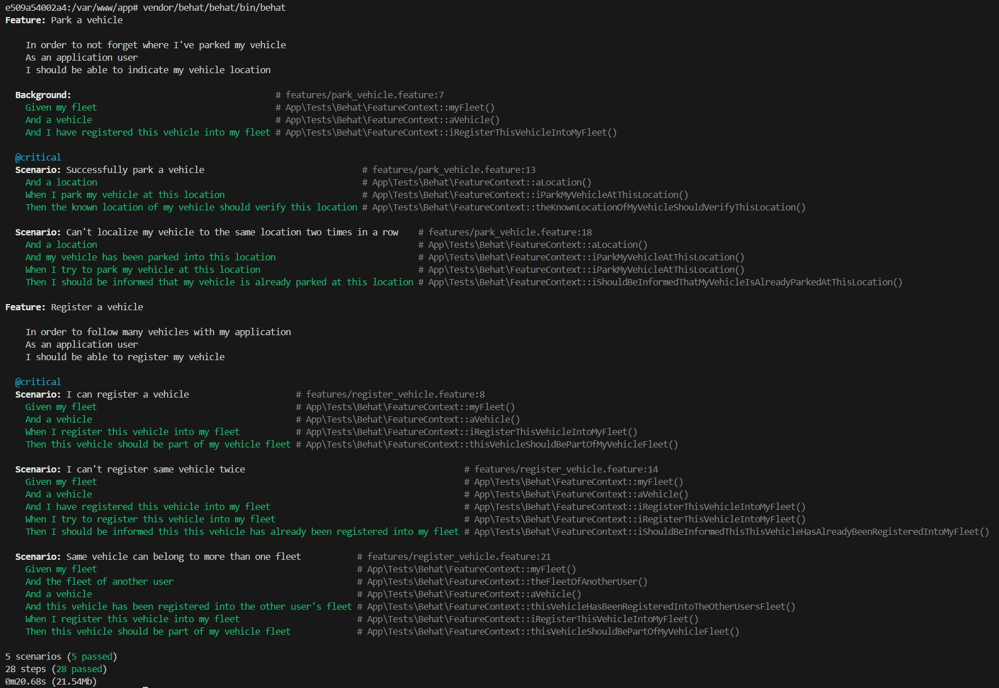
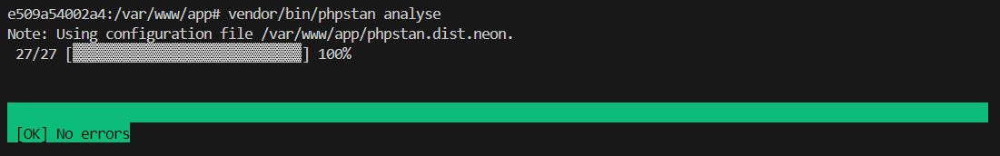

# Fulll - Hiring Test

This repository contains my solution for the Fulll hiring test, demonstrating knowledge in algorithms, Domain-Driven Design (DDD), Command Query Responsibility Segregation (CQRS), and practical use of modern PHP tools.

## Algorithm Test (FizzBuzz)

The algorithm test is accessible through the following CodeSandbox environment:

- [FizzBuzz Algorithm Test](https://codesandbox.io/p/devbox/5l2j8g)

---

## Backend Test (Intermediate/Senior Level: DDD & CQRS)

### Tech Stack
- PHP 8.1
- Symfony 6.4 (Steps Two & Three)
- Doctrine ORM (Steps Two & Three)
- MySQL (Steps Two & Three)
- Behat (BDD)
- Apache (Docker)
- Docker

### Step One

This initial step uses plain PHP without any frameworks. Data persistence is handled in-memory.

#### Requirements

- PHP 8.1
- Composer

#### Installation

Install dependencies by running:

```bash
composer install
```

#### Running Tests

Execute tests with Behat using the following command:

```bash
php vendor/behat/behat/bin/behat
```

Expected test results:


---

### Steps Two & Three

These steps build upon the logic implemented in Step One but now utilize the Symfony 6.4 framework, Doctrine ORM, and MySQL for persistence, running within Docker containers.

#### Requirements

- Docker

#### Installation

> **Note**: Although using a Makefile would streamline the process, Windows compatibility concerns led me to opt for explicit Docker commands to ensure smooth setup across all environments (Windows & Linux).

Follow the steps below:

1. **Navigate to Project Directory**

```bash
cd stepTwoTree
```

2. **Build & Start Docker Services**

```bash
docker-compose up -d --build
docker exec -it fulll_test_php-fpm bash
```

3. **Install Dependencies & Clear Cache**

```bash
composer install
php bin/console cache:clear
```

4. **Set Up Database**

```bash
php bin/console doctrine:database:create
php bin/console doctrine:migrations:migrate
```

5. **Run Behat Tests**

```bash
vendor/behat/behat/bin/behat
```

6. **Run PHPStan Analysis**

```bash
vendor/bin/phpstan analyse
```

After completing these steps, your environment is ready.

---

### Console Commands

**Create a Fleet:**

```bash
php bin/console fleet:create "First Fleet"
```

**Register a Vehicle to Fleet:**

```bash
php bin/console fleet:register-vehicle "First Fleet" "ABC123"
```

**Localize Vehicle to a Specific Location:**

```bash
php bin/console fleet:localize-vehicle "First Fleet" "ABC123" 43.2 5.4
```

---

### Code Quality Tools

- **PHPStan (Level 10)**: Performs strict static analysis to detect potential bugs, ensure type safety, and enforce best coding practices, leading to robust, high-quality code.

- **PHP CS Fixer**: Applies Symfony-based coding standards consistently, ensures strict typing, short-array syntax, removes unused imports, aligns PHPDoc annotations, and enforces strict comparisons, resulting in clean and maintainable code.

---

### CI/CD Process

To be completed

---

### Expected Results

**Behat:**



**PHPStan:**

