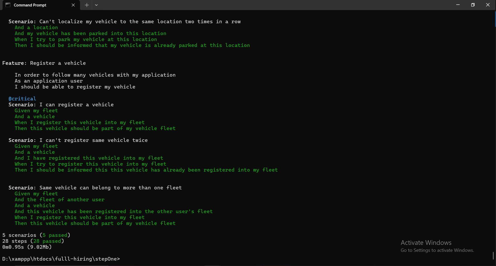

# Fulll - Hiring Test

This repository contains my solution for the Fulll hiring test, demonstrating knowledge in algorithms, Domain-Driven Design (DDD), Command Query Responsibility Segregation (CQRS), and practical use of modern PHP tools.

## Algorithm Test (FizzBuzz)

The algorithm test is accessible through the following CodeSandbox environment:

- [FizzBuzz Algorithm Test](https://codesandbox.io/p/devbox/5l2j8g)

---

## Backend Test (Intermediate/Senior Level: DDD & CQRS)

### Tech Stack
- PHP 8.1
- Symfony 6.4 (Steps Two & Three)
- Doctrine ORM (Steps Two & Three)
- MySQL (Steps Two & Three)
- Behat (BDD)
- Apache (Docker)
- Docker

### Step One

This initial step uses plain PHP without any frameworks. Data persistence is handled in-memory.

#### Requirements

- PHP 8.1
- Composer

#### Installation

Install dependencies by running:

```bash
composer install
```

#### Running Tests

Execute tests with Behat using the following command:

```bash
php vendor/behat/behat/bin/behat
```

Expected test results:



---